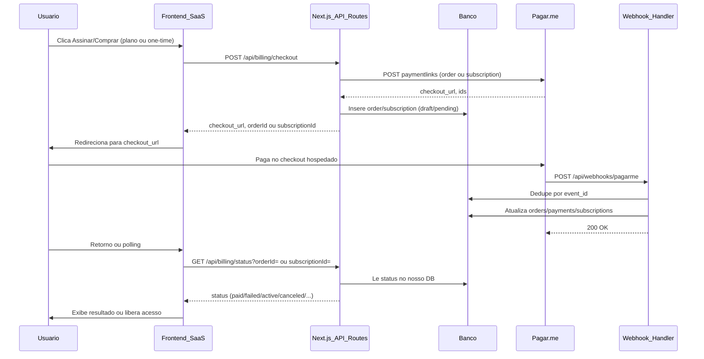

# Plano de integração: Checkout hospedado Pagar.me

Documento de arquitetura e blueprint para integrar o **Checkout hospedado** (Link de Pagamento) da Pagar.me em um SaaS Next.js e Supabase. Toda a lógica de billing fica no **Next.js (App Router)** via API Routes; não se usa Fastify para billing. Suporte a **pagamento único** e **planos de recorrência** (assinaturas).

**Referências oficiais:**

- [Checkout / Link de Pagamento (overview)](https://docs.pagar.me/reference/checkout-link)
- [Utilizando o Checkout](https://docs.pagar.me/docs/checkout-use)
- [Criar Link de Pagamento (endpoint, ambiente SDX)](https://docs.pagar.me/reference/criar-link)
- [Pedidos (order)](https://docs.pagar.me/reference/pedidos-1)
- [Webhooks](https://docs.pagar.me/docs/webhooks)
- [Eventos de Webhook](https://docs.pagar.me/reference/eventos-de-webhook-1)
- [Princípios básicos / versionamento (v3)](https://docs.pagar.me/v3/reference/principios-basicos)

**Versão da API:** Confirmar no dashboard Pagar.me qual versão de API Keys está em uso. Este plano assume **v5**. Produção: `https://api.pagar.me/core/v5`. Testes (SDX): `https://sdx-api.pagar.me/core/v5`.

---

## 1. Fluxo e arquitetura

### 1.1 Diagrama do fluxo



Resumo: (a) usuário clica no SaaS; (b) front chama **Next.js API** (`/api/billing/checkout`); (c) API cria payment link na Pagar.me (tipo `order` ou `subscription`) e persiste order/assinatura; (d) API retorna `checkout_url`; (e) front redireciona; (f) pagamento no checkout hospedado; (g) webhook chama a **mesma app Next.js** (`/api/webhooks/pagarme`); (h) handler valida, deduplica, atualiza DB e libera acesso; (i) página de retorno ou polling consulta status via API — **nunca** liberar acesso com base em redirect.

### 1.2 Responsabilidades

| Camada | Responsabilidade |
|--------|------------------|
| **Frontend (Next.js pages)** | Chamar `POST /api/billing/checkout`, redirecionar para `checkout_url`, opcionalmente página de retorno com polling em `GET /api/billing/status`. Não coleta cartão; não decide acesso por URL de sucesso. |
| **Next.js API Routes** | Criar customer/link na Pagar.me, persistir em `billing_customers`, `billing_orders`, `billing_subscriptions` etc., expor checkout e status. Única camada que fala com Pagar.me; nunca confiar no front para estado de pagamento. |
| **Webhook (POST /api/webhooks/pagarme)** | Única fonte de verdade para evento de pagamento. Validar assinatura (se houver), deduplicar por `event_id`, atualizar orders/payments/subscriptions, marcar evento processado. |
| **DB (Supabase)** | Armazenar billing_customers, billing_plans, billing_orders, billing_payments, billing_subscriptions, billing_webhook_events. Estado de acesso (e plano ativo) deriva do status no DB. |

---

## 2. Segurança, idempotência e reconciliação

### 2.1 Segurança

- **Nunca** confiar no retorno do front (redirect, query params) para liberar acesso. A fonte de verdade é o webhook + estado no DB.
- API key da Pagar.me apenas no backend (variáveis de ambiente); nunca expor no front.
- Validar assinatura do webhook se a Pagar.me fornecer (consultar doc de webhooks); rejeitar payloads inválidos.
- Não logar payloads completos com dados sensíveis (cartão, CPF etc.); logar apenas `event_id`, tipo e IDs de order/charge.

### 2.2 Idempotência

- **Criação do link:** Ao criar o checkout, usar `order_code` único (ex.: UUID ou `user_id + timestamp`) no request à Pagar.me. Opcionalmente: verificar se já existe order em aberto para aquele usuário/produto antes de criar novo link, para evitar múltiplos links para o mesmo “pedido”.
- **Webhook:** Sempre deduplicar por `event_id` (ou id do evento) na tabela `webhook_events`. Se o evento já foi processado, retornar 200 e não reprocessar. Garante que atrasos ou retentativas da Pagar.me não dupliquem atualizações.

### 2.3 Reconciliação

- Job periódico (cron): buscar `billing_orders` em estado `pending` com `created_at` além de um limite (ex.: 24h).
- Para cada uma, opcionalmente consultar a API Pagar.me (GET order por `pagarme_order_id`) e atualizar status no DB se tiver mudado (ex.: pago fora do nosso webhook).
- Registrar eventos em `billing_webhook_events` com `processed_at` null quando o processamento falhar; usar isso para retry ou alertas, sem reprocessar eventos já processados (dedupe por `event_id`).
- Webhooks podem chegar fora de ordem: processar de forma idempotente e, se necessário, basear decisões no estado mais “avançado” (ex.: paid prevalece sobre pending).

---

## 3. Banco de dados: existente e novas tabelas

### 3.1 Análise do que já existe (`backend/schema.sql`)

Referência: **`backend/schema.sql`** — schema em uso hoje.

- **profiles** — `id` (PK, FK `auth.users` ON DELETE CASCADE), `email`, `full_name`, `avatar_url`, `organization_id` (link à org), `role` (`owner` | `admin` | `member`), `created_at`, `updated_at`. Usar `profiles(id)` como `user_id` onde o fluxo for “quem iniciou” (ex.: checkout).
- **organizations** — `id` (PK, UUID com `uuid_generate_v4()`), `name`, `slug` (UNIQUE), `created_at`. Hoje **não** há `plan`, `stripe_*` nem `updated_at`; o billing Pagar.me será a fonte de verdade nas tabelas `billing_*`.

Convenções do schema atual: extensão `uuid-ossp`, `uuid_generate_v4()` para PKs, `timestamptz default now()`, FKs explícitas onde aplicável. As novas tabelas de billing seguem o mesmo estilo e referenciam `organizations(id)` e `profiles(id)`.

### 3.2 Novas tabelas (billing)

Todas com prefixo `billing_` para não conflitar com domínios futuros. Seguem as mesmas convenções (UUID, timestamptz, FKs para `profiles` e `organizations`).

- **billing_customers** — Um registro por organização na Pagar.me (customer = organização que paga).
  - `id` (PK, UUID), `organization_id` (FK organizations), `pagarme_customer_id` (TEXT), `created_at`, `updated_at`.
  - Índice único em `organization_id`; único em `pagarme_customer_id`.

- **billing_plans** — Catálogo de planos (recorrência ou one-time).
  - `id` (PK, UUID), `name` (TEXT), `slug` (TEXT UNIQUE, ex.: `starter_monthly`), `amount_cents` (INT), `currency` (TEXT default BRL), `interval` (TEXT nullable: `month`, `year` ou null para one-time), `pagarme_plan_id` (TEXT nullable), `created_at`, `updated_at`.

- **billing_orders** — Pedidos de pagamento único (ou primeira cobrança de assinatura, conforme fluxo Pagar.me).
  - `id` (PK, UUID), `organization_id` (FK), `user_id` (FK profiles, nullable — quem iniciou), `plan_id` (FK billing_plans, nullable), `status` (TEXT: `draft` | `pending` | `paid` | `failed` | `canceled` | `refunded`), `amount_cents` (INT), `currency` (TEXT), `order_code` (TEXT UNIQUE), `pagarme_order_id` (TEXT), `pagarme_payment_link_id` (TEXT), `metadata` (JSONB), `created_at`, `updated_at`, `paid_at` (TIMESTAMPTZ).
  - Índices: `organization_id`, `order_code`, `pagarme_order_id`, `status`.

- **billing_subscriptions** — Assinaturas (recorrência).
  - `id` (PK, UUID), `organization_id` (FK), `plan_id` (FK billing_plans), `status` (TEXT: `pending` | `active` | `canceled` | `past_due` | `trialing` etc.), `pagarme_subscription_id` (TEXT), `current_period_start` (TIMESTAMPTZ), `current_period_end` (TIMESTAMPTZ), `canceled_at` (TIMESTAMPTZ), `metadata` (JSONB), `created_at`, `updated_at`.
  - Índices: `organization_id`, `pagarme_subscription_id`, `status`.

- **billing_payments** — Pagamentos (cobranças) ligados a order ou a subscription.
  - `id` (PK, UUID), `order_id` (FK billing_orders, nullable), `subscription_id` (FK billing_subscriptions, nullable), `status` (TEXT), `payment_method` (TEXT: `credit_card` | `boleto` | `pix`), `pagarme_charge_id` (TEXT), `raw_payload` (JSONB), `created_at`, `updated_at`. Constraint: pelo menos um de `order_id` ou `subscription_id` não nulo.

- **billing_webhook_events** — Deduplicação e auditoria de webhooks.
  - `id` (PK, UUID), `event_id` (TEXT UNIQUE), `type` (TEXT), `received_at` (TIMESTAMPTZ), `processed_at` (TIMESTAMPTZ), `payload` (JSONB), `signature_ok` (BOOLEAN), `created_at`.
  - Índice único em `event_id`.

### 3.3 Alterações em tabelas existentes (opcional)

No `schema.sql` atual, **organizations** tem só `id`, `name`, `slug`, `created_at`. Se quiser espelhar billing na própria org (consultas rápidas, ex.: “qual plano desta org?”):

- Adicionar em **organizations**: `plan` (TEXT, ex.: `FREE`, `STARTER`, `PRO`, `ENTERPRISE`), `pagarme_customer_id` (TEXT), `updated_at` (timestamptz). O webhook pode atualizar `plan` quando `billing_subscriptions` ficar `active`.
- Caso contrário, usar apenas as tabelas `billing_*` como fonte de verdade e derivar o plano da org via join com `billing_subscriptions` e `billing_plans`.

### 3.4 Exemplo de migration (novas tabelas)

Arquivo sugerido: `backend/supabase/migrations/004_billing_tables.sql` (apenas novas tabelas; não altera `profiles` nem `organizations`. Como já existem 002 e 003, usar 004.)

Convenções do exemplo: `uuid_generate_v4()` (igual ao `schema.sql`), extensão `uuid-ossp` já existente. A migration `004_billing_tables.sql` inclui a função `update_updated_at_column` para os triggers, pois o `schema.sql` atual não a define.

```sql
-- Billing: customers (1 por organização na Pagar.me)
CREATE TABLE billing_customers (
    id UUID PRIMARY KEY DEFAULT uuid_generate_v4(),
    organization_id UUID NOT NULL REFERENCES organizations(id) ON DELETE CASCADE,
    pagarme_customer_id TEXT NOT NULL,
    created_at TIMESTAMPTZ DEFAULT now(),
    updated_at TIMESTAMPTZ DEFAULT now(),
    UNIQUE(organization_id),
    UNIQUE(pagarme_customer_id)
);

-- Catálogo de planos (one-time ou recorrência)
CREATE TABLE billing_plans (
    id UUID PRIMARY KEY DEFAULT uuid_generate_v4(),
    name TEXT NOT NULL,
    slug TEXT NOT NULL UNIQUE,
    amount_cents INT NOT NULL,
    currency TEXT NOT NULL DEFAULT 'BRL',
    interval TEXT CHECK (interval IS NULL OR interval IN ('month', 'year')),
    pagarme_plan_id TEXT,
    created_at TIMESTAMPTZ DEFAULT now(),
    updated_at TIMESTAMPTZ DEFAULT now()
);

-- Pedidos (pagamento único ou link tipo order)
CREATE TABLE billing_orders (
    id UUID PRIMARY KEY DEFAULT uuid_generate_v4(),
    organization_id UUID NOT NULL REFERENCES organizations(id) ON DELETE CASCADE,
    user_id UUID REFERENCES profiles(id) ON DELETE SET NULL,
    plan_id UUID REFERENCES billing_plans(id) ON DELETE SET NULL,
    status TEXT NOT NULL DEFAULT 'draft' CHECK (status IN ('draft', 'pending', 'paid', 'failed', 'canceled', 'refunded')),
    amount_cents INT NOT NULL,
    currency TEXT NOT NULL DEFAULT 'BRL',
    order_code TEXT NOT NULL UNIQUE,
    pagarme_order_id TEXT,
    pagarme_payment_link_id TEXT,
    metadata JSONB DEFAULT '{}'::jsonb,
    created_at TIMESTAMPTZ DEFAULT now(),
    updated_at TIMESTAMPTZ DEFAULT now(),
    paid_at TIMESTAMPTZ
);
CREATE INDEX idx_billing_orders_org ON billing_orders(organization_id);
CREATE INDEX idx_billing_orders_order_code ON billing_orders(order_code);
CREATE INDEX idx_billing_orders_pagarme ON billing_orders(pagarme_order_id);
CREATE INDEX idx_billing_orders_status ON billing_orders(status);

-- Assinaturas (recorrência)
CREATE TABLE billing_subscriptions (
    id UUID PRIMARY KEY DEFAULT uuid_generate_v4(),
    organization_id UUID NOT NULL REFERENCES organizations(id) ON DELETE CASCADE,
    plan_id UUID NOT NULL REFERENCES billing_plans(id) ON DELETE RESTRICT,
    status TEXT NOT NULL DEFAULT 'pending' CHECK (status IN ('pending', 'active', 'canceled', 'past_due', 'trialing')),
    pagarme_subscription_id TEXT,
    current_period_start TIMESTAMPTZ,
    current_period_end TIMESTAMPTZ,
    canceled_at TIMESTAMPTZ,
    metadata JSONB DEFAULT '{}'::jsonb,
    created_at TIMESTAMPTZ DEFAULT now(),
    updated_at TIMESTAMPTZ DEFAULT now()
);
CREATE INDEX idx_billing_subscriptions_org ON billing_subscriptions(organization_id);
CREATE INDEX idx_billing_subscriptions_pagarme ON billing_subscriptions(pagarme_subscription_id);
CREATE INDEX idx_billing_subscriptions_status ON billing_subscriptions(status);

-- Pagamentos (order e/ou subscription)
CREATE TABLE billing_payments (
    id UUID PRIMARY KEY DEFAULT uuid_generate_v4(),
    order_id UUID REFERENCES billing_orders(id) ON DELETE SET NULL,
    subscription_id UUID REFERENCES billing_subscriptions(id) ON DELETE SET NULL,
    status TEXT NOT NULL,
    payment_method TEXT CHECK (payment_method IN ('credit_card', 'boleto', 'pix')),
    pagarme_charge_id TEXT,
    raw_payload JSONB,
    created_at TIMESTAMPTZ DEFAULT now(),
    updated_at TIMESTAMPTZ DEFAULT now(),
    CONSTRAINT chk_billing_payments_ref CHECK (order_id IS NOT NULL OR subscription_id IS NOT NULL)
);
CREATE INDEX idx_billing_payments_order ON billing_payments(order_id);
CREATE INDEX idx_billing_payments_sub ON billing_payments(subscription_id);

-- Webhooks: dedupe por event_id
CREATE TABLE billing_webhook_events (
    id UUID PRIMARY KEY DEFAULT uuid_generate_v4(),
    event_id TEXT NOT NULL UNIQUE,
    type TEXT NOT NULL,
    received_at TIMESTAMPTZ DEFAULT now(),
    processed_at TIMESTAMPTZ,
    payload JSONB,
    signature_ok BOOLEAN,
    created_at TIMESTAMPTZ DEFAULT now()
);
CREATE INDEX idx_billing_webhook_events_event_id ON billing_webhook_events(event_id);

-- Triggers updated_at (a migration 004_billing_tables.sql define update_updated_at_column no início, pois schema.sql não a tem)
CREATE TRIGGER update_billing_customers_modtime BEFORE UPDATE ON billing_customers FOR EACH ROW EXECUTE PROCEDURE update_updated_at_column();
CREATE TRIGGER update_billing_plans_modtime BEFORE UPDATE ON billing_plans FOR EACH ROW EXECUTE PROCEDURE update_updated_at_column();
CREATE TRIGGER update_billing_orders_modtime BEFORE UPDATE ON billing_orders FOR EACH ROW EXECUTE PROCEDURE update_updated_at_column();
CREATE TRIGGER update_billing_subscriptions_modtime BEFORE UPDATE ON billing_subscriptions FOR EACH ROW EXECUTE PROCEDURE update_updated_at_column();
CREATE TRIGGER update_billing_payments_modtime BEFORE UPDATE ON billing_payments FOR EACH ROW EXECUTE PROCEDURE update_updated_at_column();
```

---

## 4. Rotas no Next.js (App Router)

Toda a API de billing e o webhook ficam no **dashboard** (Next.js), em API Routes do App Router. Base URL: a mesma do front (ex.: `https://app.seudominio.com`). Não se usa Fastify para billing.

| Método | Rota (arquivo) | Auth | Descrição |
|--------|-----------------|------|-----------|
| POST   | `/api/billing/checkout` → `dashboard/src/app/api/billing/checkout/route.ts` | Sim (session Supabase/cookies) | Cria payment link na Pagar.me (tipo `order` ou `subscription`), persiste em `billing_orders` ou `billing_subscriptions`, retorna `checkout_url` e `orderId` ou `subscriptionId`. Body sugerido: `{ type: 'order' \| 'subscription', planId?, amountCents, currency, name? }`. |
| GET    | `/api/billing/status` → `dashboard/src/app/api/billing/status/route.ts` | Sim | Query: `?orderId=...` ou `?subscriptionId=...`. Retorna status no nosso DB (não chama Pagar.me). Fonte de verdade é o que foi atualizado pelo webhook. |
| POST   | `/api/webhooks/pagarme` → `dashboard/src/app/api/webhooks/pagarme/route.ts` | Não (público) | Recebe webhooks; valida assinatura se aplicável; dedupe por `event_id` em `billing_webhook_events`; atualiza `billing_orders` / `billing_payments` / `billing_subscriptions`; marca `processed_at`; responde 200 rápido. |

**Frontend (Next.js):**

- Chamar `POST /api/billing/checkout` com body definido pelo contrato; redirecionar o usuário para `checkout_url`.
- (Opcional) Página de retorno: ex. `/billing/return?orderId=...` ou `?subscriptionId=...` com polling em `GET /api/billing/status` até status final (paid/failed/active/canceled). Nunca liberar acesso só por estar nessa página.

---

## 5. Checklist de implementação

- [ ] Confirmar no dashboard Pagar.me que as API Keys são **v5** e qual ambiente (produção vs SDX).
- [ ] Definir base URL: produção `https://api.pagar.me/core/v5` ou SDX `https://sdx-api.pagar.me/core/v5` conforme doc [Criar Link](https://docs.pagar.me/reference/criar-link).
- [ ] Configurar variáveis de ambiente no dashboard: `PAGARME_API_KEY`, `PAGARME_WEBHOOK_SECRET` (se a Pagar.me usar), e base URL.
- [ ] Criar webhook no dashboard Pagar.me com URL pública do **Next.js** (ex.: `https://app.seudominio.com/api/webhooks/pagarme`). Em dev usar tunnel (ngrok) e testar recebimento de eventos.
- [ ] Implementar deduplicação por `event_id` e registro em `billing_webhook_events`; processamento idempotente; responder 200 rápido (processar em background se necessário para evitar timeout).
- [ ] Feature flag ou config para habilitar billing no SaaS.
- [ ] Logging e alertas mínimos: erros ao processar webhook, orders “stuck” em pending além do prazo.
- [ ] Segurança: segredos em env; não logar dados sensíveis; não expor API key no front.
- [ ] Política de retry: webhook handler idempotente; em falha, registrar (ex.: `processed_at` null) e ter job de reconciliação para consultar Pagar.me e atualizar status.

---

## 6. Exemplos mínimos (sem credenciais)

### 6.1 Body para criar payment link (type order)

Endpoint: `POST {baseUrl}/paymentlinks`. Autenticação: Basic com API key (sk_test ou sk_live).

Campos essenciais para pagamento único (tipo order):

```json
{
  "type": "order",
  "name": "Plano Pro - Pagamento único",
  "order_code": "ord_uuid_ou_slug_unico",
  "payment_settings": {
    "accepted_payment_methods": ["credit_card", "pix", "boleto"]
  },
  "cart_settings": {
    "items": [
      {
        "name": "Plano Pro",
        "amount": 9900,
        "default_quantity": 1
      }
    ]
  },
  "customer_settings": {
    "customer": {
      "name": "Nome do Cliente",
      "email": "email@exemplo.com",
      "code": "user_id_do_saas"
    }
  }
}
```

Valores em centavos. A resposta inclui `checkout_url` e IDs do link/pedido; persistir em `billing_orders` (`pagarme_payment_link_id`, `pagarme_order_id`, `order_code`).

### 6.2 Body para criar link tipo subscription (recorrência)

Para assinaturas, usar `type: "subscription"` e referenciar um plano na Pagar.me (ou enviar `subscription_settings` com ciclo). Exemplo mínimo:

```json
{
  "type": "subscription",
  "name": "Plano Pro - Mensal",
  "subscription_settings": {
    "billing_cycle": { "interval": "month", "interval_count": 1 },
    "payment_methods": ["credit_card", "pix", "boleto"]
  },
  "cart_settings": {
    "items": [{ "name": "Plano Pro", "amount": 9900, "default_quantity": 1 }]
  },
  "customer_settings": {
    "customer": { "name": "Nome", "email": "email@exemplo.com", "code": "organization_id_ou_user_id" }
  }
}
```

Persistir em `billing_subscriptions` e tratar eventos `subscription.created`, `subscription.activated`, `subscription.canceled`, `invoice.paid`, `invoice.payment_failed`, etc., conforme documentação Pagar.me.

### 6.3 Exemplo de payload de webhook (estrutura típica)

Evento tipo `order.paid` ou `charge.paid` (estrutura pode variar; consultar [Eventos de Webhook](https://docs.pagar.me/reference/eventos-de-webhook-1)):

- Extrair `event.id` ou equivalente para dedupe.
- Extrair `data.id` (order ou charge ou subscription), `data.status`, e quando aplicável `data.order.id`, `data.payment_method`.
- Para **order**: buscar por `pagarme_order_id` em `billing_orders` e setar `status = 'paid'`, `paid_at = now()`; inserir/atualizar em `billing_payments`.
- Para **subscription**: buscar por `pagarme_subscription_id` em `billing_subscriptions` e atualizar `status`, `current_period_start`, `current_period_end`; opcionalmente atualizar `organizations.plan` quando assinatura ficar ativa.
- Registrar em `billing_webhook_events`: `event_id`, `type`, `received_at`, `processed_at`, `payload` (ou resumo), `signature_ok`.

Não confiar em dados do redirect; usar apenas o que vier no webhook e no DB.

### 6.4 Tabela de transição de estados (order)

| Estado atual | Evento / condição        | Novo estado |
|--------------|---------------------------|-------------|
| draft        | Link criado com sucesso   | pending     |
| pending      | order.paid / charge.paid  | paid        |
| pending      | order.payment_failed      | failed      |
| pending      | order.canceled            | canceled    |
| paid         | charge.refunded           | refunded    |

Definir no código as transições permitidas e ignorar eventos que não alterem o estado (idempotência).

### 6.5 Estados de subscription (recorrência)

| Estado       | Evento / condição                    | Ação no DB |
|-------------|--------------------------------------|------------|
| pending     | subscription.created / link criado   | Criar/atualizar `billing_subscriptions` |
| active      | subscription.activated / invoice.paid| `status = 'active'`, atualizar period_start/end; opcionalmente `organizations.plan` |
| canceled    | subscription.canceled                | `status = 'canceled'`, `canceled_at = now()` |
| past_due    | invoice.payment_failed (recorrência)  | `status = 'past_due'`; definir política de retry/cancelamento |

---

## 7. Decisões abertas

- **Quais eventos inscrever no webhook:** Mínimo: `order.paid`, `order.payment_failed`, `order.canceled`, `charge.refunded`. Para recorrência: `subscription.created`, `subscription.activated`, `subscription.canceled`, `invoice.paid`, `invoice.payment_failed`. Incluir outros conforme doc Pagar.me.
- **Prazo para “order stuck”:** Tempo após o qual uma order em `pending` dispara reconciliação (ex.: 24h ou 48h).
- **Idempotência na criação do link:** Usar `order_code` (ou equivalente para subscription) como chave de correlação; evitar criar novo link quando já existir order/subscription em aberto para o mesmo org/plano.
- **Espelhar Pagar.me em `organizations`:** Manter apenas em `billing_*` ou adicionar `pagarme_customer_id` / `pagarme_subscription_id` em `organizations` para consultas rápidas (ex.: “esta org tem assinatura ativa?”).

---

## 8. Regras do MVP (não negociar)

- Não usar checkout transparente com cartão (tokenize card); não coletar dados de cartão no SaaS. Checkout é 100% hospedado na Pagar.me.
- Não liberar acesso com base em “success redirect”. Apenas webhook + atualização no DB.
- Sempre deduplicar webhooks por `event_id` e registrar recebimento e processamento.
- Considerar que webhooks podem chegar fora de ordem; processamento deve ser idempotente e baseado no estado final (ex.: paid prevalece).
